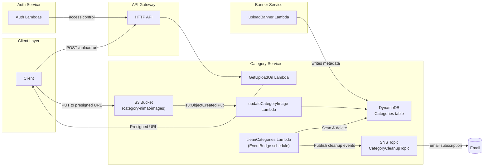

# System Architecture (AWS)

The diagram below shows how the `auth`, `banner`, and `category` services interact with AWS services (S3, DynamoDB, SNS, Lambda, API Gateway).

Legend:

- Solid arrows indicate event flow or API calls.
- `cleanCategories` is scheduled using EventBridge (Serverless schedule event).
