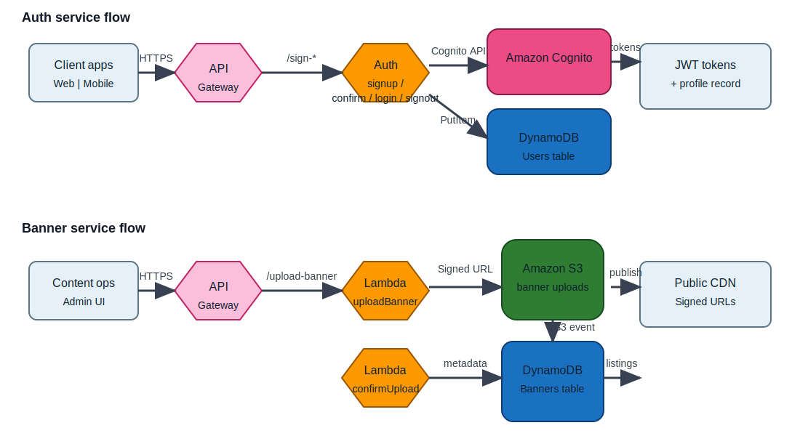

# E-commerce Microservice Lambdas



This repository contains two lightweight Serverless Framework services that power user authentication and marketing banner management for an e-commerce platform. Each service is an isolated AWS Lambda application with its own infrastructure-as-code definition, yet both share a consistent Node.js 24 runtime, HTTP API front door, and DynamoDB persistence for audit trails.

## Repository layout

| Folder | Description |
| --- | --- |
| `auth/` | Cognito-backed sign-up, confirmation, sign-in, and global sign-out lambdas, plus a DynamoDB `Users` table for storing profile metadata. |
| `banner/` | Banner upload pipeline that generates presigned URLs, stores assets in S3, and writes banner metadata to a DynamoDB `Banners` table once S3 fires an event. |

The [`banner/communication-diagram.svg`](banner/communication-diagram.svg) banner above illustrates every Lambda function, how it talks to AWS managed services, and which events trigger downstream handlers. Shapes mimic AWS architecture icons (API Gateway, Lambda, Cognito, S3, and DynamoDB) to keep the visualization familiar to cloud engineers.

## Lambda communication flows

### Auth service
1. **Clients call API Gateway** through the `/sign-up`, `/confirm`, `/login`, or `/signout` HTTP routes defined in `auth/serverless.yml`.
2. **Auth Lambda handlers** (`handlers/signUp.js`, `confirmSignUp.js`, `signIn.js`, `signOut.js`) execute inside AWS Lambda and use the AWS SDK v3 to reach downstream services.
3. **Amazon Cognito** handles user pool operations. The Cognito App Client ID is injected via the `CLIENT_ID` environment variable (sourced from AWS Systems Manager Parameter Store).
4. **Amazon DynamoDB** (`Users` table) receives a `PutItem` from `models/userModel.js` whenever a sign-up succeeds so that the platform has auditable profile data.
5. **Responses propagate back through API Gateway** to client applications with Cognito tokens and/or confirmation messages.

### Banner service
1. **Content operators** call the `/upload-banner` HTTP route defined in `banner/serverless.yml`.
2. The **`uploadBanner` Lambda** validates payloads and returns an S3 presigned URL (via `@aws-sdk/client-s3` and the request presigner helper) so the browser can upload binary content directly to `banner-nimat-images-ads`.
3. **Amazon S3** raises an `ObjectCreated:Put` event for the `banners/` prefix, which triggers the **`confirmUpload` Lambda**.
4. The `confirmUpload` handler writes metadata into the **`Banners` DynamoDB table** with the public CDN URL so downstream services can show the new banner.
5. Optional publishing or caching layers can watch the `Banners` table stream to invalidate CDN entries or notify storefront apps.

## Getting started

### Prerequisites
- Node.js 18+ and npm (for dependency management and the Serverless CLI).
- [Serverless Framework CLI v4](https://www.serverless.com/framework/docs/getting-started) installed globally (`npm i -g serverless`).
- AWS credentials with access to Lambda, API Gateway, S3, DynamoDB, Cognito, and Systems Manager Parameter Store in `us-east-1`.
- A Cognito User Pool + App Client for the auth service; S3 bucket/DynamoDB table names match the values declared in each `serverless.yml` (or will be generated on deploy).

### Install dependencies
Each service maintains its own `node_modules`. Install packages from inside the service folders:

```bash
cd auth
npm install @aws-sdk/client-cognito-identity-provider @aws-sdk/client-dynamodb

cd ../banner
npm install @aws-sdk/client-s3 @aws-sdk/s3-request-presigner @aws-sdk/client-dynamodb
```

### Configure environment

| Variable | Where it’s used | Notes |
| --- | --- | --- |
| `REGION` | All Lambda handlers | Defaults to `us-east-1`; export locally so SDK clients know which region to hit. |
| `CLIENT_ID` | `auth` handlers | Injected from `ssm:/CLIENT_ID` at deploy time; when running locally, export it manually. |
| `BUCKET_NAME` | `banner` handlers | Defaults to `banner-nimat-images-ads`; can be overridden through Serverless stages. |
| `DYNAMODB_TABLE` | `banner` handlers | Maps to the `Banners` table resource. |

Store sensitive values in Parameter Store before deploying:

```bash
aws ssm put-parameter \
  --name /CLIENT_ID \
  --value <cognito_app_client_id> \
  --type SecureString \
  --overwrite
```

### Deploy
Deploy services independently so each stack can scale on its own cadence:

```bash
cd auth
serverless deploy --stage dev

cd ../banner
serverless deploy --stage dev
```

Tear down with `serverless remove --stage dev` from the corresponding directory.

### Local development & invocation
- `serverless dev` keeps an interactive tunnel open for rapid iteration (available inside each service folder).
- Invoke handlers locally with payloads:

```bash
# Auth sign-up
serverless invoke local -f signup --data '{"email":"me@example.com","fullName":"Jane Doe","password":"Sup3rSecure!"}'

# Banner upload URL
serverless invoke local -f uploadBanner --data '{"fileName":"hero.png","fileType":"image/png"}'
```

Ensure the environment variables listed above are exported before running local invokes.

## Testing the deployed endpoints

```bash
API_BASE="https://<api-id>.execute-api.us-east-1.amazonaws.com"

curl -X POST "$API_BASE/sign-up"   -d '{"email":"me@example.com","fullName":"Jane Doe","password":"Sup3rSecure!"}'
curl -X POST "$API_BASE/confirm"   -d '{"email":"me@example.com","code":"123456"}'
curl -X POST "$API_BASE/login"     -d '{"email":"me@example.com","password":"Sup3rSecure!"}'
curl -X POST "$API_BASE/signout"   -d '{"token":"<AccessToken>"}'

curl -X POST "$API_BASE/upload-banner" \
  -H "Content-Type: application/json" \
  -d '{"fileName":"spring-hero.jpg","fileType":"image/jpeg"}'
```

Use the returned presigned URL to upload the file with `curl -T spring-hero.jpg '<signedUrl>'`. Once the upload succeeds, the S3 event will trigger `confirmUpload`, which inserts the banner record into DynamoDB.

## Extending the platform
- Add authentication/authorization (e.g., Cognito authorizers) on the banner upload route.
- Connect the `Banners` table to DynamoDB Streams or EventBridge to notify merchandising services when a creative asset changes.
- Layer unit tests around each handler and wire them into CI/CD before allowing automated deployments.

This README plus the AWS-icon diagram should give newcomers enough context to deploy, operate, and evolve both Lambda-based microservices.
